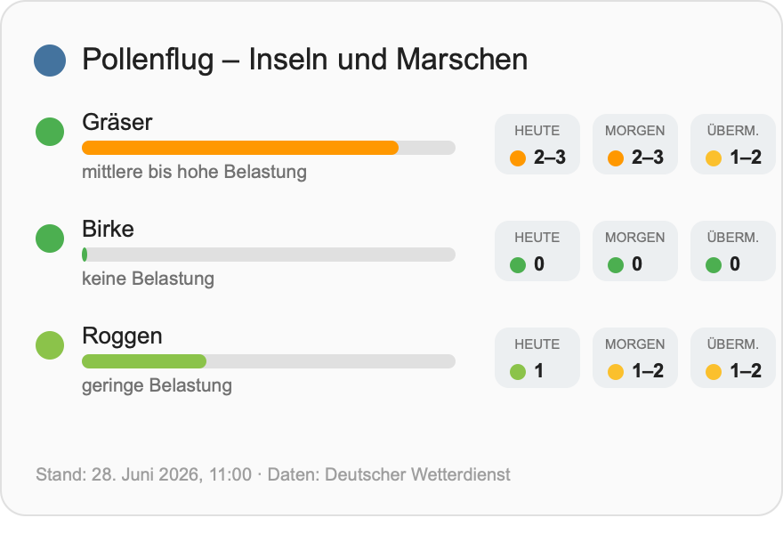

# DWD Pollenflug Card

A self-contained Lovelace card for the
[`dwd_pollenflug`](https://github.com/NerdySoftPaw/ha-dwd-pollenflug) Home
Assistant integration. No build step, no dependencies — a single plain custom
element, with a graphical editor and live preview in the card picker.



## Install

### HACS (recommended)

1. HACS → ⋮ → **Custom repositories** → add
   `https://github.com/NerdySoftPaw/lovelace-dwd-pollenflug-card` with category
   **Dashboard** (a.k.a. Lovelace / Plugin).
2. Install **DWD Pollenflug Card**. HACS registers the dashboard resource
   automatically.
3. Hard-refresh the browser (Ctrl/Cmd+Shift+R).

### Manual

1. Copy `dwd-pollenflug-card.js` into `config/www/`.
2. **Settings → Dashboards → ⋮ → Resources → Add**: URL
   `/local/dwd-pollenflug-card.js`, type **JavaScript Module**.
3. Hard-refresh.

## Usage

Add a card → search **DWD Pollenflug Card** in the picker (it ships a GUI editor
that auto-discovers the integration's sensors). Or in YAML:

```yaml
type: custom:dwd-pollenflug-card
title: Pollenflug – Inseln und Marschen   # optional; auto-derived from the device
forecast: true                            # optional (default true)
entities:
  - sensor.<region>_grasses
  - sensor.<region>_birch
  - sensor.<region>_hazel
  - sensor.<region>_alder
  - sensor.<region>_ash
  - sensor.<region>_rye
  - sensor.<region>_mugwort
  - sensor.<region>_ragweed
```

Override a label with `{ entity: sensor.x, name: "Custom" }`.

## What it shows

- Per pollen type: icon, name, a colour-coded level bar (index `0`–`3`, green →
  red, half-steps interpolated) and the German burden description for **today**.
- Optional chips for **Heute / Morgen / Übermorgen** with a colour dot and the
  index band (e.g. `2–3`); hover for the description.
- Footer: DWD `last_update` timestamp and attribution.

## Licence

MIT. Data: Deutscher Wetterdienst (DWD).
